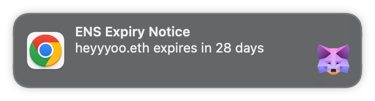

# MetaMask Snap for ENS Name Renewal Reminders

This Snap will notify users when ENS names they own are about to expire. In-app and native notifications are sent weekly starting 45 days prior to expiration. The ENS data is fetched from the [ENS subgraph](https://thegraph.com/hosted-service/subgraph/ensdomains/ens). There is no configuration needed beyond installing the Snap.

It currently runs on goerli, but switching to mainnet is trivial (line 50 of [/packages/snap/src/helpers.ts](/packages/snap/src/helpers.ts)).

## Getting Started

Install [MetaMask Flask](https://metamask.io/flask/) and import the following mnemonic: `off boy shoulder praise promote bracket thank six fog level document predict`. Switch to the Goerli network.

Clone [the repo](https://github.com/gskril/ens-renewal-snap) and setup the development environment:

```shell
yarn install && yarn start
```

Visit http://localhost:8000/ and install the Snap. At the start of each minute, you should get the following browser and MetaMask notifications:



